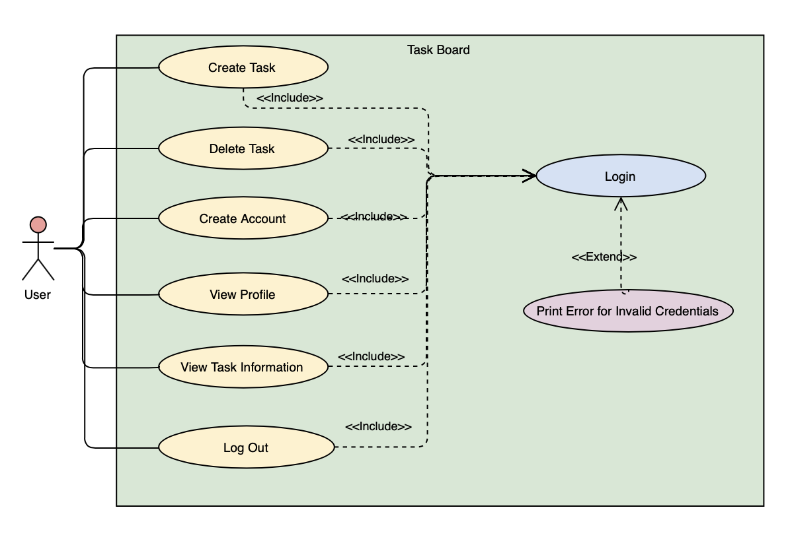
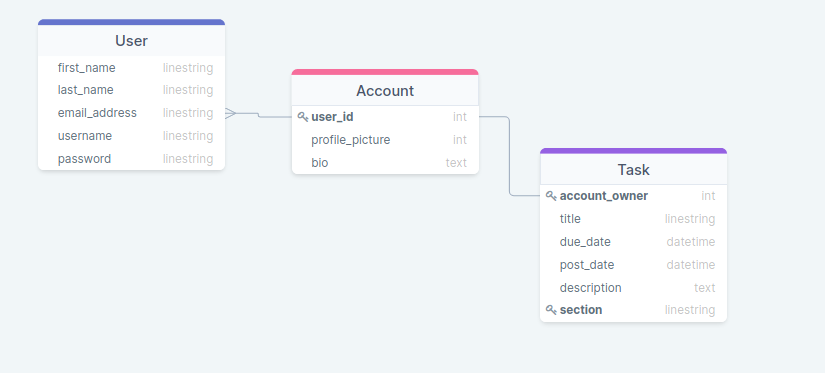

# Task Board 

### Introduction

This is a Task Board web application developed using HTML5, CSS3, JS, Python, and Django. This application was developed to enhance our knowledge on software engineering topics and to demonstrate how these concepts are used in the industry. 

### Group Roles

<ins>Front-End:</ins> Molly Croke, Ericles Santos  
<ins>Back-End:</ins> Nick Almeder  
<ins>Full-Stack:</ins> Carlos Sousa

### Planning

We used many modern tools to plan and develop this application. We would meet up for weekly scrum meetings to talk about the product using Discord and designed the layout of the website using Figma, a UI tool. The web application design can be found [here](https://www.figma.com/file/SGmS1xOpopGxiCIE9D3Njf/SoftEngMockup?node-id=0%3A1).

### Software Design

Our software consists of models, views, and URLs. In our application we created a URL for each specific page on our site. Each URL was then connected to a Python function, called a view, that returns a rendered HTML document that we choose. Within these functions we can import our database tables and call pre-built methods to create queries and return a queryset that can then be rendered in our HTML document using Django template tagging. The design for our database consists of three tables, a User table, an Account table, and a Task table. These tables are connected through foreign keys, our Account and User tables have a 1 to 1 relationship while our Account and Task tables have a 1 to M relationship.
You can also see another representation of our design through our use case diagram  and our schema diagram 

### Testing

During development we did continous testing at each stage of our development life cycle. We would each add additional features and test them in a separate branch before merging back to the main branch. We have also been testing through using the product, any bugs that are found are notified to one of us and we fix them.